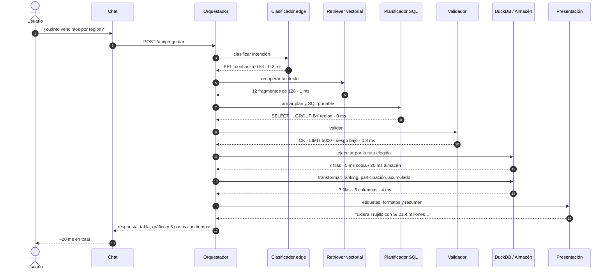
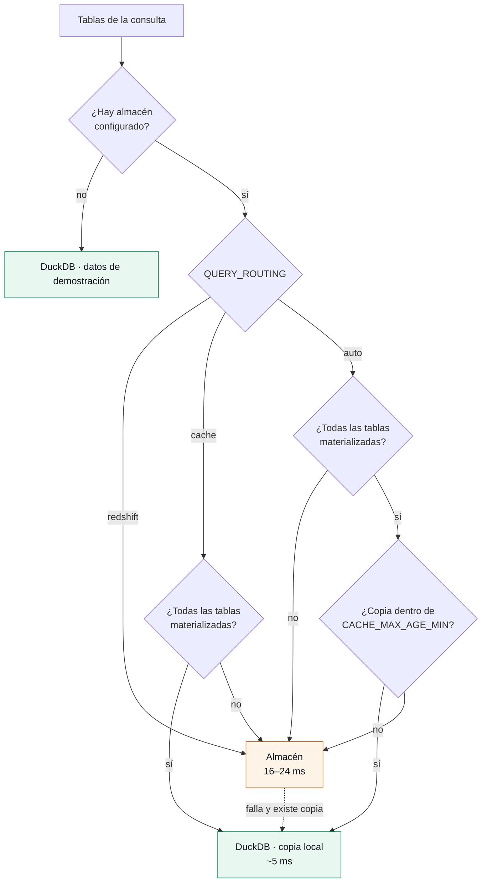
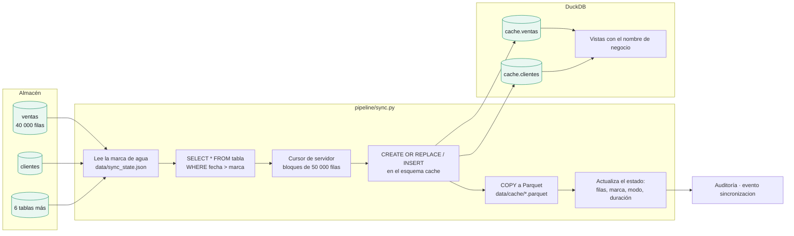
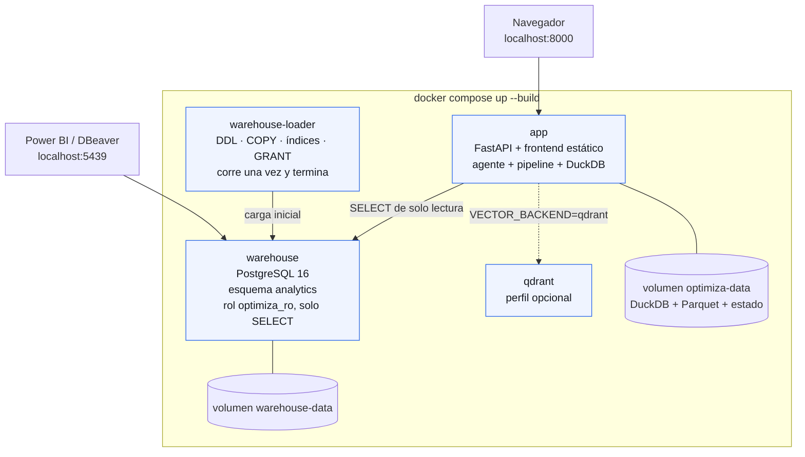
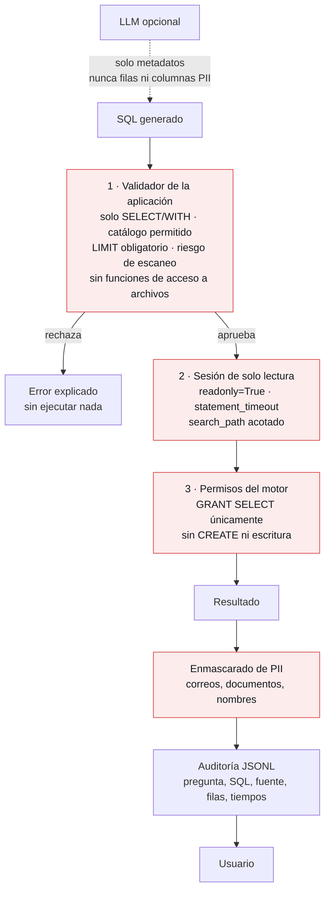
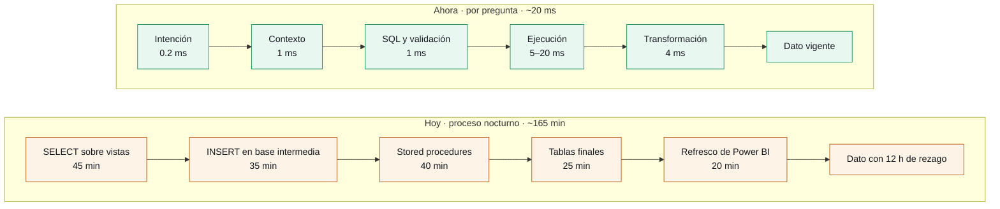

# Arquitectura — Optimiza Conversacional

Diagramas en Mermaid, que GitHub renderiza directamente. Para presentaciones existe la versión
en [`arquitectura.svg`](arquitectura.svg).

---

## 1. Vista general

```mermaid
flowchart LR
    subgraph NAV["Navegador"]
        UI["Chat de una columna<br/>vista ejecutiva / modo experto"]
        ADM["Configuración<br/>metadata, relaciones, sync"]
    end

    subgraph APP["Aplicación · FastAPI"]
        direction TB
        ORQ["Orquestador<br/>pasos cronometrados"]

        subgraph AG["Agente"]
            direction LR
            CLS["1 · Clasificador edge ES<br/>CPU · sin red · ~0.1 ms"]
            RAG["2 · Retriever vectorial<br/>128 documentos"]
            GEN["3 · Generador SQL<br/>determinista + LLM opcional"]
            VAL["4 · Validador<br/>solo lectura · LIMIT · escaneo"]
        end

        RUT{"5 · Ruteo<br/>¿dónde ejecuto?"}

        subgraph POST["Post-proceso"]
            direction LR
            TRF["6 · Transformación DuckDB<br/>window functions"]
            PII["7 · Enmascarado de PII"]
            VIZ["8 · Gráfico + indicadores"]
            PRE["9 · Lenguaje de negocio"]
        end
    end

    subgraph DAT["Datos"]
        direction TB
        RS[("Almacén analítico<br/>Redshift / PostgreSQL<br/>usuario de solo lectura")]
        DD[("DuckDB embebido<br/>esquema cache + Parquet")]
    end

    SYNC["Materialización incremental<br/>marca de agua por tabla"]
    LOAD["Carga del almacén<br/>DDL · COPY · GRANT SELECT"]

    UI --> ORQ
    ADM --> ORQ
    ORQ --> CLS --> RAG --> GEN --> VAL --> RUT
    RUT -->|copia vigente| DD
    RUT -->|copia vencida o ausente| RS
    RS -.->|respaldo si falla| DD
    DD --> TRF
    RS --> TRF
    TRF --> PII --> VIZ --> PRE --> UI

    RS ==>|extracción por bloques| SYNC ==>|INSERT / REPLACE| DD
    LOAD ==> RS

    classDef agente fill:#eff4ff,stroke:#2563eb,color:#16191f
    classDef datos fill:#e9f7f1,stroke:#0f8a5f,color:#16191f
    classDef proceso fill:#fdf4e7,stroke:#b45309,color:#16191f
    class CLS,RAG,GEN,VAL,ORQ,TRF,PII,VIZ,PRE agente
    class RS,DD datos
    class SYNC,LOAD proceso
```

---

## 2. Una pregunta, paso a paso

Tiempos reales medidos contra el almacén local, con la copia materializada vigente.

---

## 3. Dónde se ejecuta cada consulta

El validador extrae las tablas del SQL; con esa lista el orquestador decide y deja el motivo
escrito en el panel de pasos.

---

## 4. Materialización Redshift → DuckDB

Reemplaza al proceso nocturno: en vez de mover todo de madrugada, trae solo lo nuevo, cuando
hace falta.

Primera corrida completa medida: **71 482 filas en 458 ms**. Las siguientes son incrementales.

---

## 5. Despliegue con Docker

Para un Redshift real, `warehouse` y `warehouse-loader` desaparecen: se cambian las variables
`REDSHIFT_*` y queda solo `app`. El Terraform de [`infra/`](../infra/) crea el cluster.

---

## 6. Capas de seguridad

Tres controles independientes. Ninguno sustituye a otro.

Verificado con pruebas de integración: el usuario de la aplicación recibe
`permission denied for table ventas` al intentar `DELETE`, y
`permission denied for schema analytics` al intentar `CREATE TABLE`.

---

## 7. Comparación con el proceso actual

Una pregunta nueva, hoy, exige cambiar el ETL y desplegar. En el flujo conversacional no
requiere código: si la metadata la describe, el agente la responde.

---

## Referencias al código

| Bloque del diagrama | Archivo |
|---|---|
| Clasificador edge | [`backend/app/agent/intent_classifier.py`](../backend/app/agent/intent_classifier.py) |
| Retriever vectorial | [`backend/app/semantic/`](../backend/app/semantic/) |
| Generador SQL | [`backend/app/agent/planner.py`](../backend/app/agent/planner.py), [`llm.py`](../backend/app/agent/llm.py) |
| Validador | [`backend/app/agent/validator.py`](../backend/app/agent/validator.py) |
| Ruteo y pasos cronometrados | [`backend/app/agent/orchestrator.py`](../backend/app/agent/orchestrator.py) |
| Motores | [`backend/app/engines/`](../backend/app/engines/) |
| Carga y materialización | [`backend/app/pipeline/`](../backend/app/pipeline/) |
| Seguridad | [`backend/app/security/`](../backend/app/security/), [`docker/warehouse/01-init.sql`](../docker/warehouse/01-init.sql) |
| Presentación de negocio | [`backend/app/agent/presentacion.py`](../backend/app/agent/presentacion.py) |
